## Summer Internship Program 2020-21

# MapLite :autonomous navigation without detailed prior maps

### By

## Awies Mohammad Mulla 

## Abstract

Most autonomous vehicles currently rely on high-definition prior maps in order to localize and navigate in their environment. In this project we aim to localize the vehicle using only onboard sensors and sparse topometric map which is publicly online. We tested this algorithm on two outdoor datasets - KITTI and Ati to generate a pre-driven trajectory. The performance of the algorithm can be quantified by level of similarity between generated trajectory and groundtruth.

## Introduction

Localization is an integral part of autonomous driving, where the vehicle has to estimate its current pose on the map [1]. It is also a common process of Simultaneous Localization and Mapping (SLAM). Over the years, several studies have emerged to solve the problem of localization and SLAM as a whole. Some of the work uses geostationary satellites to pinpoint the location of the vehicle. While the accuracy approach has improved in recent times, this is still not reliable in several geographic regions due to bad signal reception. There are other studies which combine measurements from the odometry sensors with LiDAR and/or visual sensors like stereo cameras. Typically, Bayesian filters such as Kalman filters, Particle filters, are used to give final estimate of vehicle pose. The mentioned algorithms have largely evolved over past decade to the point of being used extensively in real-life deployments. For large numbers of states in a system Kalman filters are usually the first choice, and Particle filters are used for lower number of states due to their high runtime. But while working with these algorithms, we often require maps with precisely-annotated landmarks.

Generating High-definition metric maps consume huge amount of time and resources. Moreover, maps do not stay static. Sufficient changes in the region may trigger remapping efforts. So, it is inefficient to generate such a map for a remote area with low population density and no appropriate landmarks. Maplite [2] is a pioneering study in such situations as it uses a topometric map and road segmentation for localization.

The objective of this project is to localize the vehicle in real-time using, LiDAR, IMU, wheel encoder and a topometric map of the location. We assume that the initial position of the vehicle is known apriori.

## Maplite

This algorithm aims to localize the the vehicle using odometry sensors, LiDAR, and topometric map of the location. The topometric maps are simple graph-like data structures. Hence, for each map $M$ 
$$
M=\{V,E\} \nonumber
$$
where, each vertex describes a way point and each edge describes a road segment. However, while the connectivity of the network can be assumed to be relatively correct, the same cannot be said for either the relative or global accuracy of the specific waypoints. Compared to high-definition metric precise maps, less time and effort is required to generate topometric map. They also require far less storage capacity. For testing the algorithm on KITTI dataset we have used the map available on <u>openstreetmap.org</u> for the coordinates mentioned in datasets. An example of topometric map is shown below 

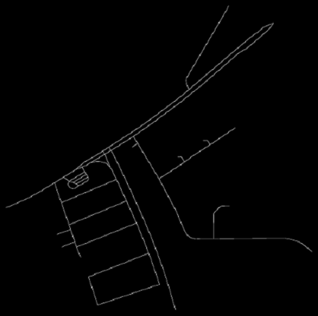

### Algorithm

The algorithm is mainly carried out in two steps:

1. Estimating the prior distribution or Odometry-based prediction
2. Correction using LiDAR Observation likelihood

#### Odometry-based prediction

We estimate a prior distribution in this step using an Extended Kalman Filter given initial pose of the vehicle, input provided and measurements from wheel encoder and inertial measurement unit (IMU). The implementation of the Extended Kalman Filter is explained below.

Let the pose of vehicle at time t be $\bf{x}_t$ and the input provided be $u_t$. In addition, let the covariance matrix at time $t$ be $P_t$ and noise in the wheel encoder measurement be indicated as $\sigma_u $.
$$
\begin{align*}\nonumber
\bold{x}_t &= [x_t, y_t,\theta_t]\\ \nonumber
u_t &= [v_t,\omega_t]\\
\nonumber\sigma_u &= \begin{bmatrix}\sigma_v^2& 0\\ 0& \sigma_\omega^2\end{bmatrix}\\
\end{align*}
$$

The covariance matrix is initialized to
$$
P_0 = \begin{bmatrix}0.1& 0& 0\\ 0& 0.1& 0\\ 0& 0& 0.01\end{bmatrix}
$$

  ##### EKF Prediction step 

The unicycle model is used to predict the state of the robot at the current state given the control input and the previous state
$$
\begin{align*}
\hat{\bold{x}}_{t+1} &= \bold{x}_t+\begin{bmatrix} v_t\cos \theta_t dt\\ v_t\sin \theta_t dt\\ \omega_tdt
\end{bmatrix}\\
Q &= \mathbf{E}[GG^T]\\
\hat{P}_{t+1}&=FP_tF^T+Q
\end{align*}
$$

where, $F = \begin{bmatrix}1 & 0& -v_t\cos\theta_t dt\\0 & 1& v_t\sin\theta_t dt\\0 & 0 & 1\end{bmatrix}$,  is the jacobian of the process model evaluated at ${x}_{t}$ w.r.t. states and,

$G = \begin{bmatrix}n_v\cos\theta_tdt& 0\\ n_v\sin\theta_tdt& 0\\ 0& n_{\omega}dt\end{bmatrix}$  is the noise sample. Then the process noise $Q$ can be evaluated as 
$$
Q = G\sigma_u G^T
$$

For the simulation study we take $\sigma_v^2 = 0.1$ and $\sigma_\omega^2=0.01$

##### EKF Correction step

Using the accelerometer and the gyro measurements,  the IMU measurement model can be updated as
$$
z_{t} = \begin{bmatrix} v^x_{t} + a^x_tdt\\ v^y_{t} + a^y_tdt\\ \omega_t \end{bmatrix}\nonumber
$$
Then the estimated velocity is given by,
$$
h(\hat{\bold{x}}_{t+1}) = \begin{bmatrix} \hat{v}_{t+1}\cos \hat{\theta}_{t+1} \\ \hat{v}_{t+1}\sin \hat{\theta}_{t+1} \\ \hat{\omega}_{t+1} \end{bmatrix}\nonumber
$$
For the simulation study, measurement noise $R = \begin{bmatrix}0.1& 0& 0\\ 0& 0.1& 0\\ 0& 0& 0.01\end{bmatrix}$

The correction step can then be written as,
$$
\begin{align}
\bold{x'}_{t+1} &= \bold{\hat{x}}_{t+1}\ + \ K(z_t\ - \ h(\bold{\hat{x}}_{t+1}))\label{odom}\\
\nonumber K &= \hat{P}_{t+1}H^T(H\hat{P}_{t+1}H^T\ + \ R)^{-1}\\
\nonumber P_{t+1} &= (I_{3\bf{x}3} \ - \ KH)\hat{P}_{t+1}
\end{align}
$$
where, $H$ is jacobian of $h(\bold{\hat{x}}_{t+1})$ evaluated at the predicted state ($\bold{\hat{x}}_{t+1}$)
$$
H = \begin{bmatrix}0&0& -\hat{v}_{t+1}\sin \hat{\theta}_{t+1}\\ 0& 0& \hat{v}_{t+1}\cos \hat{\theta}_{t+1}\\ 0&0&0\end{bmatrix}\nonumber
$$
##### Sampling

Now, sample $k$ points in a circle with radius $r_{var}$ and center $(x_t,y_t)$. At each of these points consider $l$ distinct orientations in the interval $[\theta-\delta\theta,\theta+\delta\theta]$. 
$$
\begin{align}
(x^i,y^i)&\in\{(x^1_t,y^1_t),(x^2_t,y^2_t),(x^3_t,y^3_t),\dots(x^k_t,y^k_t)\}\label{samplex}\\
\theta^j &\in\{\theta^1_t,\theta^2_t,\theta^3_t,\dots\theta^l_t\}\label{sampletheta}
\end{align}
$$

Assign weights to each of these points according to following expression
$$
w_{ij}=\exp\left(\frac{||\bold{\hat{x}}_{t+1}-\bold{x}^i_j||}{b}\right)\label{ref}
$$
where, $b$ is a scale factor obtained by parameter tuning. Parameters $r_{var}$ and $\delta\theta$ are to be set by the user. $\delta\theta$ can be either set according to $P_{3,3}$ or be chosen depending on traction present at location. $r_{var}$ can be either set to $max(P_{1,1},P_{2,2})$ or $12-15\%$ of the road width, $r_w$. $r_{var}$ can be reduced at the end of each iteration (according to ($\ref{rvar}$)) and be increased again at beginning of next timestep, as the uncertainty increases with vehicle motion.
$$
r_{var}' = \left|ln(\frac{sc'}{sc})\right| \label{rvar}
$$
 where $sc'$ and $sc$ are scores of sampled point and prior estimated mean respectively (mentioned in ($\ref{score}$))

#### LiDAR Observation Likelihood

Each LiDAR scan $Z_t^L$ consist of $n$ $3$-tuples $\bold{z}_i=(x_i^L,y_i^L,l_i)$ where $x_i^L,y_i^L\in \real$ give the position of each measured LiDAR point in the sensor frame and $l_i\in\{0,1\}$ represent classification label indicating whether the point is on road or off-road. We define signed distance function $f_D(z_i,x_i^L,M)$ which represents the distance of point $z_i$ to the nearest point on any edge in the topological map M (given the location of vehicle, $\bold{x_t}$). The probability of observing each point $z_i$ at location $\bold{x}_t$ is expressed in terms of sigmoid function
$$
P(z_i|\bold{x}_t) = \begin{cases}
\begin{align*}
&\frac{1}{1+\exp{(f_D(z,x,M)-r_w)}} & l_i=1\\ 
&1-\frac{1}{1+\exp{(f_D(z,x,M)-r_w)}} & l_i=0
\end{align*}
\end{cases}
$$

where $r_w$ represents likelihood of finding points labeled road, far from map $M$ which contains road centerlines. For example at road center $f_D(z,x) = 0$, $P(z_i) \approx 1$ if $l_i=1$, $P(z_i) \approx 0$ if $l_i=0$ while far from the road, the converse is true. In other words, here $r_w$ can be considered as half road width. Depending on the location (type of road or lane count) $r_w$ can varied or kept constant.

Signed distances for all possible $(x_i^L,y_i^L)$ in map $M$ are calculated and stored as a look up table. This is done to improve the time complexity of the algorithm so that it can be used in real-time.

Finally, we calculate score of the current point (sampled point from $(\ref{ref})$) using following expression
$$
sc = \underset{i}{\Sigma}P(z_i|\bold{x}^i_j)\label{score}
$$

#### Fusion of Odometry prediction and LiDAR Likelihood

From $(\ref{samplex})$ and $(\ref{sampletheta})$ we have $(k\bold{x}l)$ possible poses
$$
\begin{array}{c|c}
\nonumber
(x,y)&\theta\\
\hline
(x^1,y^1)& \theta^1 \ \theta^2 \ \theta^3 \ \dots \theta^l \\
(x^2,y^2)& \theta^1 \ \theta^2 \ \theta^3 \ \dots \theta^l \\
(x^3,y^3)& \theta^1 \ \theta^2 \ \theta^3 \ \dots \theta^l \\
\vdots & \vdots \\
(x^k,y^k)& \theta^1 \ \theta^2 \ \theta^3 \ \dots \theta^l \\
\end{array}
$$
Since, LiDAR scans are obtained w.r.t. sensor frame, we now consider all the above possible poses for sensor and calculate the score (from $(\ref{score})$) for all the above poses. Now, select the pose with maximum score say $\bold{x}^i_j$ has score $sc$ with odometry weight $w_{ij}$ (from $(\ref{ref})$) and score of estimated mean pose $(\ref{odom})$ be $sc'$. We calculate the corrected pose as weighted mean of $\bold{x}^i_j$ and $\bold{x'}_{t+1}$
$$
\bold{x}_{t+1}=\frac{(w_{ij}.sc.\bold{x}^i_j)+(sc'.\bold{x'}_{t+1})}{(w_{ij}.sc)+sc'}
$$

## Results and analysis

Mentioned algorithm was tested on 3 Ati datasets and 8 KITTI datasets. Results are shown and explained below:

### Ati Datasets:

|  Dataset name   |        Original path         |                 Topometric map used                 |             Trajectory generated             |
| :-------------: | :--------------------------: | :-------------------------------------------------: | :------------------------------------------: |
|    Hospital     |   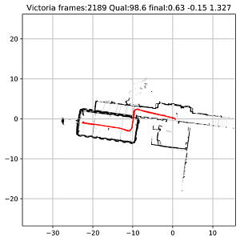    | 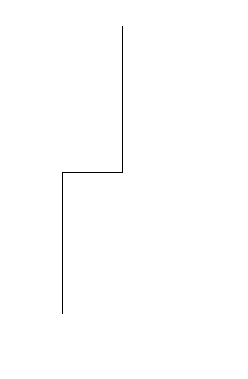 | 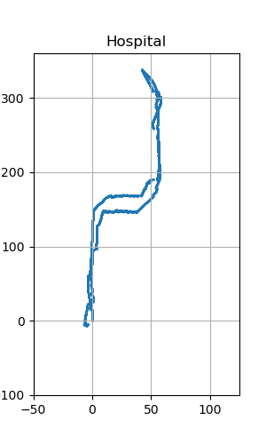 |
|     Factory     |     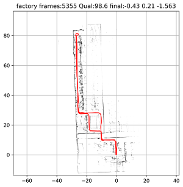     |               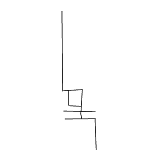                | 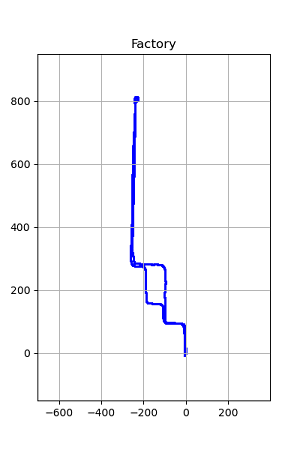  |
| HVL-multi-loops | 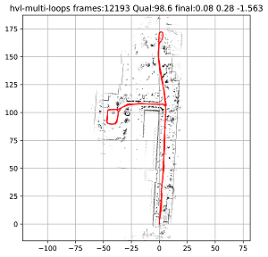 |                 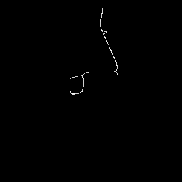                  |           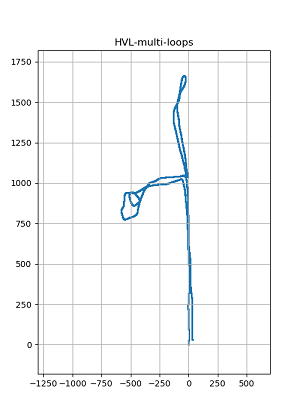           |

### KITTI Datasets:

| Drive number (2011_09_26_no.) | Topometric map used | Trajectory generated |
| :---------------------------: | :-----------------: | :------------------: |
|             0001              | 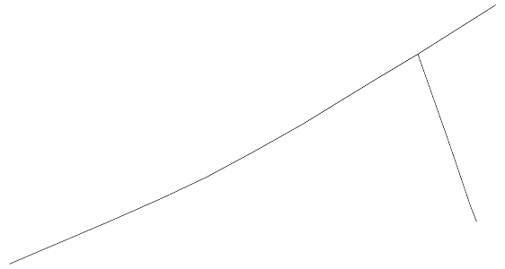 |    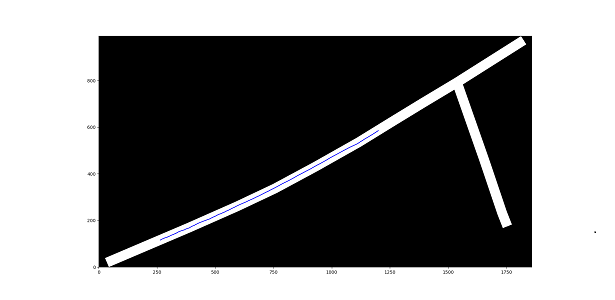     |
|             0002              | 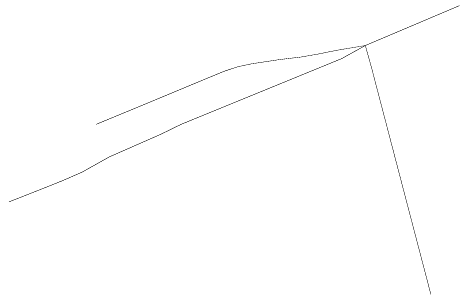 |    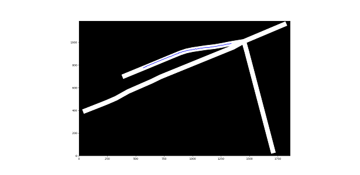     |
|             0005              | 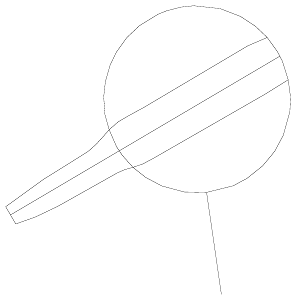 |    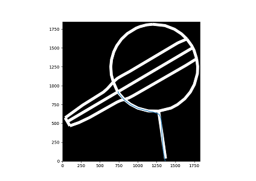     |
|             0009              | 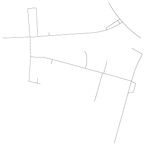 |    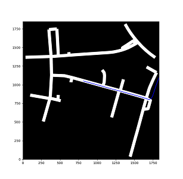     |
|             0014              | 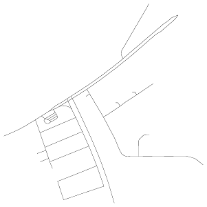 |    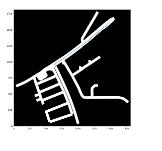     |
|             0051              | 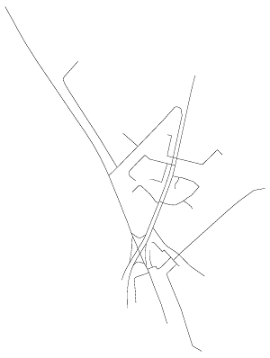 |    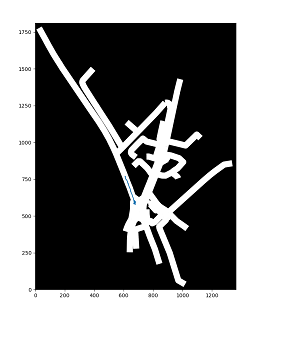     |
|             0056              | 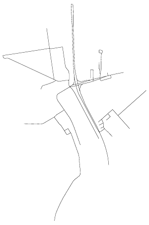 |    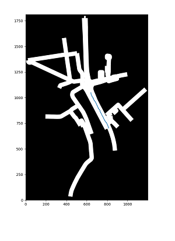     |
|             0059              | 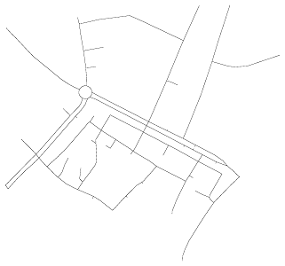 |    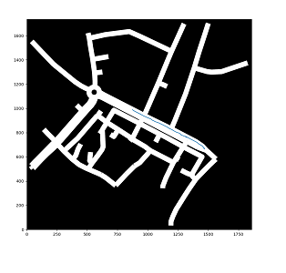     |

* The Maplite algorithm was tested on 3 Ati datasets provided by ARTPARK and 8 KITTI datasets available online. Among these, all of the Ati datasets generated trajectory which was $80-90\%$ close to the groundtruth.  The algorithm was able to generate the trajectory to 7 out of 8 KITTI datasets with about $95\%$ accuracy. The runtime for each iteration is about $90ms$.
* The process models (odometry prediction model) used for KITTI and Ati datasets were different, hence there was considerable difference in results. Final velocities from KITTI datasets were used to estimate the pose in odometry prediction step. Whereas, process model mentioned in algorithm was used for Ati dataset. So, the current LiDAR Observation Likelihood can used with other process model to achieve better results.
* Current model is sensitive to tunable $b$ parameter which acts like weight for odometry prediction pose. The appropriate value for $b$ can be chosen by considering $r_{var}$ (from ($\ref{samplex}$)), $\delta\theta$ (from ($\ref{sampletheta}$)) and accuracy of the process model.
* The labelling of lidar points as on road or off road is currently done by assuming that only the line of path of vehicle with road width $2r_w$ is the only road. While using this assumption we are unable classify all the possible road points at an intersection of roads and complete $180 \deg$ turn about a point. This leads to late correction of pose by the model and risk of running into obstacles.
* If the location where the vehicle is driven has good traction and we have considerably accurate odometry prediction model we drop out the sampling of points and only consider sampling of $\theta$. To consider this we should have a concrete model for segmentation of roads, so that error can be minimized. This can reduce the runtime of algorithm to about $50ms$.

## Future work

* The algorithm can be made robust to $b$ by improving the process model. This can be done by using Odometry-based prediction step  to estimate the $[v,\omega]$. In this approach the error generated by noise from IMU can be reduced compared to current model where $[x,y,\theta]$ is being estimated.

* We can use deep learning models similar to rangenet++, pointnet, etc for segmentation of road surface to not only navigate vehicle on drivable surface but also classify the LiDAR points as on road or off road. As mentioned in analysis current approach for classification is not concrete and prone to large errors at intersections.

* We can combine this algorithm with trajectory planning and obstacle detection algorithms to autonomously pilot the vehicle at desired destinations. Trajectory planning algorithms like A* can used with other cost functions to generate trajectory for smooth rides. Some of the cost functions which can used for trajectory optimization are mentioned below:

  Our goal is to calculate optimize the spline trajectory which starts at vehicle's position and ends at $x_g$ **local** goal point of the trajectory. This optimization utilizes a three-part cost function 

  1. Road distance cost
     $$
     J_d(q)=\frac{1}{k}\displaystyle\sum_{i=1}^{k}d(q_i)^2
     $$
     where $q$  is a candidate spline with $k$ waypoints and $d(q_i)$ is the signed distance function to the road points (points on trajectory between vehicle position and local goal point).

  2. Relative path length cost
     $$
     J_l(q)=\frac{\sum_{i=2}^{k}d(q_i,q_{i-1})}{d(x_0,x_g)}
     $$
     where $x_0$ is current vehicle location.

  3. Minimize the maximum curvature of the trajectories
     $$
     J_\kappa(q)=\max\frac{||\sigma'\times \sigma''||}{||\sigma'||^3}
     $$
     where $\sigma$ is spline representation of $q$ and, $\sigma',\sigma''$ are first and second derivatives.

  So, optimal solution is obtained by solving
  $$
  q_{opt}=\underset{q\in\chi}{argmin}[J_d(q),J_l(q),J_\kappa(q)]W_q^T
  $$
  where $\chi$ represents global trajectory and $W_q$ is a weight vector for tuning the relative importance of the cost function terms.

## References

1. Prof. Cyrill Stachniss’ lectures on SLAM algorithms. [[link]](https://www.youtube.com/playlist?list=PLgnQpQtFTOGQrZ4O5QzbIHgl3b1JHimN_)
2. [MapLite : autonomous navigation in rural environments without detailed prior maps](https://dspace.mit.edu/handle/1721.1/128346) by Teddy Ort.
