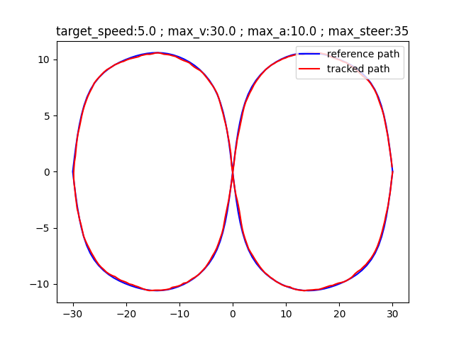

<h1>Path Planning and Tracking of Wheeled Robots</h1>

<h2>Sakshay Mahna</h2>

<h2>Internship Report</h2>

## Abstract
Motion Planning, also called Path Planning is a computational problem to find a sequence of valid configurations to move an object from a start state to an end state. Motion planning algorithms can be applied to wide range of robots, like industrial robots, wheeled robots, aerial robots and autonomous cars.

In this work, a complete Path Planning and Tracking system has been developed for use with wheeled robots. A suite of algorithms is provided with adjustable parameters to benchmark and study their efficiency and performance on various test maps. Some comparision on these algorithms have been provided as well.

## Introduction
The problem of Motion Planning can be divided into a pipeline consisting of 3 sub modules, which are: Path Planning, Path Interpolation and Trajectory Planning.

Path Planning involves the task of planning an obstacle free path (a set of points) from a start position to an end position without any regard to constraints on velocity, acceleration, curvature and so on. A*, RRT, D* are some of the examples of Path Planning algorithms. 
Path Interpolation involves the task of interpolating and smoothing the path (a set of points) generated by the path planner. Path Interpolation introduces constraints on initial and final yaw of the robot. The path can be interpolated as Linear Splines, Cubic Splines and so on.
Trajectory Planning involves the task of generating a time schedule to follow a path given constraints such as position, velocity and acceleration. Frenet Frame algorithm and MPC algorithm are some examples of Trajectory Planning algorithms.

In this report, a complete Motion Planning pipeline has been developed, along with a benchmarking tool to compare different combinations of algorithms and the effect of their parameters on different maps. 

## Path Planning Algorithms
Given a map of the environment along with the start and end positions, path planning algorithms determine the shortest route between those two points, avoiding all static obstacles.
A grid based graph is generated over the dimensions of the map. The nodes of the graph are connected in a 4 way or 8 way model with adjustable weights of the edges. The path planning algorithm is run over the grid graph and returns the shortest path based on weights. The psuedocode of some algorithms are further discussed.

### Greedy Search
In the Greedy Search strategy, the path planner takes the path which leads to minimum cost from the current position of the planner. This makes the algorithm a brute force approach. This brute force approach is computationally expensive as effectively the path planner has to check all the possible grid positions on the map.

### Dijkstra's Algorithm
Dijkstra's algorithm applies a smarter greedy search strategy. Instead of taking the minimum cost from the current position of the planner, the algorithm extends over the minimum cost path starting from the start position of the planner. This makes the search more effective than the Greedy Search algorithm. However, there are some cases where the Greedy Strategy performs better than the Dijkstra's algorithm.

### A Star
A star is a combination of the Greedy Search and Dijkstra's algorithm. By means of the weight parameter the ratio of behaviour of the algorithms can be decided. A zero magnitude weight follows a Dijkstra based approach and high magnitude weight follows a Greedy based approach. This combination of behaviour allows A star algorithm to minimize the number of iterations and path length.

**Different Motion Models**

    
    

*The left image shows 4 way motion model and the right image shows 8 way motion model*

**Different Values of Weight**

    
    
    

*The first image shows 0 weight value, having a greater path length. The second image shows a weight value of 1 and the third image shows a weight value of 10. Increasing the weight value results in a reduction in path length.*

## Path Interpolation Algorithms
Path Planning module returns a list of points which represent the shortest path from start to end position. Path Interpolation module extends an interpolation between these list of points, for the robot to follow. 
The interpolation also takes into account the initial and final heading of the robot, by means of cubic polynomial. The cartesian coordinates of the points and the heading direction act as the boundary conditions of the cubic polynomial. The various interpolation strategies are discussed further.

### Linear Interpolation
This type of interpolation fits a straight line between any two given points. The path formed by linear interpolation is not completely smooth. 
At some places, the final path contains some steep curves or have a sudden change of slope. However, the change of slope is manageable and are covered easily by Trajectory Planning algorithms.

### Cubic Interpolation
This type of interpolation fits a cubic polynomial between any two given points. The cartesian coordinates of the points and their immediate slope act as the boundary conditions for these polynomials. 
The path generated by cubic polynomial is relatively smoother than the one generated by Linear Interpolation. In order to account for smoothness, the final path also contains some random curves in the path which are again easily covered by Trajectory Planning algorithms.

### Polynomial Interpolation
This type of interpolation fits a polynomial of one less dimension than the total number of given points. This strategy is slightly different than the preceding two as here, the curve is fitted on all points simultaneously rather than on two points in a sliding fashion. 
This strategy outputs a very smooth path, however gets worse in performance and path length as the number of points increase. This algorithm is suited for paths having a very small number of points to interpolate on.

    
    
    

*The first image shows linear path interpolation, the second image shows cubic path interpolation and the third image shows polynomial interpolation. The start and end of all the paths show cubic polynomial generated path.*

## Trajectory Planning Algorithms
Trajectory Planning algorithms take the continuous curve generated by Path Interpolation algorithm and returns a series of velocity commands to follow the given trajectory, taking into account the kinematic constraints of the robot. 
Typically the trajectory planning algorithms make use of cost optimization technique to find a path the best possible path in terms of the constraints. The various trajectory planning algorithms are discussed further.

### Frenet Frame Trajectory Optimization
Frenet Frames describe the kinematic properties of a particle moving along a continuous differentiable curve. Instead of the traditional X and Y coordinates of the path to traverse, Frenet Frames make use of Lateral(Normal to curve) and Longitudinal(Tangent to curve) axes to generate a trajectory for the robot to follow. 
The cost function of the algorithm focuses on minimizing the final lateral distance, the difference between the current speed and the target speed and the jerk on the robot.
The algorithm makes use of Quintic Polynomials to do the cost optimization. By varying the boundary conditions, like final velocity, time to reach, final lateral and longitudinal positions, various quintic polynomials are generated. The parameters generated from these polynomials are used to determine the magnitude of the cost function.
The trajectory giving the minimum value of cost function is choosen for the robot to follow.

The algorithm is very good under a highway based scenario, as the algorithm automatically decides whether to move at higher speed, follow a certain car or to overtake a car, which are the 3 most typical use cases.
Under gaussian noise, the Frenet Frame method is robust to noise at high speeds. However, under low speeds(very close to 0), the algorithm is affected by noise, and suffers from some level of diversion from the planned path.
Also, the performance of the algorithm is affected by increasing number of possible boundary conditions. The algorithm has to deal with a larger number of polynomials with increasing possible values of the boundary conditions, resulting in greater processing times.

**Different Highway Scenarios**

    
    
    
    
    

*The above set of images show the velocity keeping functionality of the Frenet Frame method*

    
    
    
    
    \
    
    
    

*The above set of images show the velocity keeping and the following strategies of Frenet Frame method*

**Effect of Noise**

    
    
    

*The above set of images show the effect of observational noise on the Frenet Frame Trajectory Planning algorithm. The leftmost image shows the effect of Gaussian Noise with standard deviation of 0.1, the middle image shows the effect of Gaussian Noise with standard deviation of 0.2 and the rightmost image shows the effect of Gaussian Noise with standard deviation of 0.4. A noise of 0.4 is very unlikely in real scenarios, hence the Frenet Frame algorithm is quite robust to noise.*

### Model Predictive Control
Model Predictive Control is a general method of control that is used to control a process while satisfying a set of constraints. The algorithm generates a trajectory for some future time (called the Prediction Horizon). From the generated trajectory, the robot takes the first step on the trajectory and then recalculates the trajectory for the next prediction horizon.
The cost function of the algorithm focuses on the deviation from the original path, difference from target velocity, angle of heading, acceleration, angular velocity and jerk.
For the optimization part, the algorithm can make use of any minimization algorithm. For the purpose of the project the algorithm makes use of SLSQP (Sequential Least Squares Programming).

This algorithm is quite robust to noise(gaussian) at different speeds and follows the reference path well.
At high speeds, the MPC algorithm starts to deviate slightly from the reference path in order to maintain the target speed.
However, the algorithm lacks obstacle avoidance capability, which makes it difficult for the robot to avoid dynamic obstacles at the trajectory planning stage. 

**Different Target Speeds**

    
    
    

*The leftmost image shows the tracking for target speed of 5, the middle image shows target speed of 10 and the rightmost image shows a target speed of 20. As the speed increases, the tracker tries to maintain the target speed making it slightly deviate from the reference path.*

**Effect of Noise**

    
    
    

*The above set of images show the effect of observational noise on the MPC algorithm. The leftmost image shows the effect of Gaussian Noise with standard deviation of 0.1, the middle image shows the effect of Gaussian Noise with standard deviation of 0.2 and the rightmost image shows the effect of Gaussian Noise with standard deviation of 0.3. Even at a very high noise of 0.3 standard deviation the algorithm seems to be pretty robust.*

## Results and Analysis
- Both the Trajectory Planning algorithms are quite robust to noise and follow the reference path very well under certain conditions.

- The Frenet Frame Trajectory Optimization algorithm is robust to noise under higher speeds. Under low speeds the algorithm suffers from some amount of deviation under normal gaussian noise. Also, the algorithm offers a good obstacle avoidance mechanism as well.

- The Model Predictive Control algorithm is robust to noise at high as well as slow speeds. With increasing speeds, the algorithm starts deviating from the reference path. Also, the algorithm does not provide any capability to deal with dynamic obstacles.

- It may be concluded, that Frenet Frame algorithm is suited for robots at higher speeds and the MPC algorithm is suited for robots under lower speeds. A particular use case for Frenet Frame algorithm would be an Autonomous Car driving on traffic based roads, and for MPC algorithm would be a warehouse based robot required to navigate from one place to another.

## Future Work

- There are various other algorithms for Path Planning, Path Interpolation and Trajectory Planning. The performance of all these algorithms can be compared to develop a study regarding different algorithm use cases.

- The suite of algorithms can be extended to make these implementations ready for use on hardware. Currently, these algorithms only work on software based simulations, and on a set amount of maps.

- The performance of these algorithms can be compared in real life scenarios, by implmenting them on hardware.

## References

- M. Werling et al, [Optimal Trajectory Generation for Dynamic Street Scenarios in a Frenet Frame](https://www.researchgate.net/publication/224156269_Optimal_Trajectory_Generation_for_Dynamic_Street_Scenarios_in_a_Frenet_Frame)

- Python Robotics by Atsushi Sakai [Github Repository](https://github.com/AtsushiSakai/PythonRobotics)

- Bench-MR [Github Repository](https://robot-motion.github.io/bench-mr/)

- Moving AI 2D [Map Dataset](https://www.movingai.com/benchmarks/grids.html)